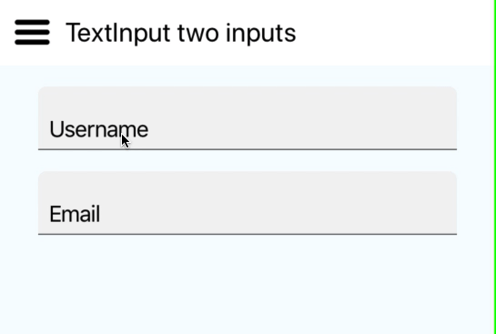

# DailyComponent

> Isn't it a pleasure to study and practice what you have learned?
>
> _- Confucius_

## TextInput with floating label

With this component, I have tried to implement a text input field with a
floating label, much like the one in Material Design.

* Requirement: Click on the form then label moves away from input field. If a
  user click away from the field without entering anything, the labels moves
  back to where it was.
* Reflection: `Animated.value.interpolate` is super handy when you have multiple
  targets of animatable components with a single driver. Here we are adjusting
  Y locationof label once the text input is focused as well as well srhinking
  its size with one `Animated.value`
